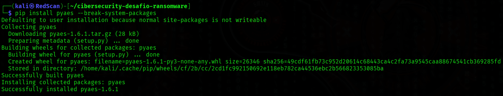
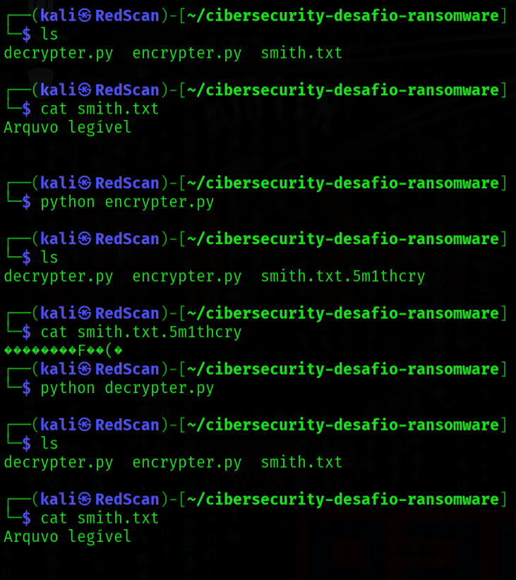

# smithcry
Ransonware para criptografar e decriptografar um arquivo com uma chave específica.

## Obs.: Atividade meramente com objetivo didático de realizar a tarefa proposta pela DIO na Formação Cybersecurity Specialist.

Detalhes da formação Aprenda na prática a utilizar ferramentas e técnicas voltadas para a área de Cibersegurança, abrindo grandes possibilidades de carreira nesse mercado que vem crescendo exponencialmente. Na trilha iremos abordar os conceitos e fundamentos de Cibersegurança, Sistemas Operacionais, Redes de computadores, Ferramentas de testes de intrusão e Simulações de ataques em redes. Ao final dessa jornada você estará capacitado(a) para criar aplicações e soluções mais seguras, como também para iniciar a sua carreira na área. Em relação aos pré-requisitos para a Formação, não há impedimentos. Contudo, conhecer uma linguagem de programação e ter noções básicas de linhas de comando e Linux é um excelente começo. Bora lá?

## pré-requisito: instalar o módulo pyaes

$ pip install pyaes

$ pip install pyaes --break-system-packages

- Instalação da dependencia:
  

## Executando o RansonWare no arquivo smith.txt

- Exemplo de uso:
  

